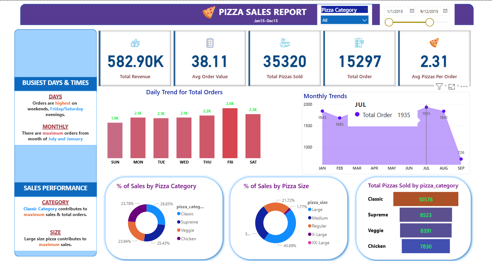

# 🍕 Pizza Sales Report – Power BI Dashboard

This repository contains a Power BI dashboard project analyzing **Pizza Sales Data** from Jan 15 to Dec 15. The dashboard provides key insights into total revenue, order trends, sales by category, and performance by pizza size.

---

## 📂 Project Files

| File Name        | Description                                |
|------------------|--------------------------------------------|
| `pizza.pbit`     | Power BI template file for the dashboard   |
| `Dashboard.png`  | Screenshot preview of the dashboard        |
| `README.md`      | Project overview and usage instructions    |

---

## 📊 Key Insights from Dashboard

- **💰 Total Revenue:** 582.9K  
- **📦 Total Orders:** 15,297  
- **🍕 Total Pizzas Sold:** 35,320  
- **📈 Avg. Order Value:** $38.11  
- **🍕 Avg. Pizzas per Order:** 2.31

---

## 🔍 Sales Analysis

### 🗓️ Busiest Days & Times
- **Days:** Peak sales on **Friday** and **Saturday** evenings  
- **Months:** Highest orders in **July** and **January**

### 📋 Sales Performance
- **Top Category:** Classic pizzas lead in both sales and volume  
- **Top Size:** Large size pizzas contribute most to revenue

---

## 📌 Visuals Included

- KPI Cards (Revenue, Orders, AOV, etc.)
- Daily & Monthly Order Trend Charts
- Donut Charts for:
  - % Sales by Pizza Category
  - % Sales by Pizza Size
- Bar Chart for Total Pizzas Sold by Category

---

## 🚀 How to Use

1. **Download** the `.pbit` file.
2. **Open** it in Power BI Desktop.
3. **Connect** to your pizza sales dataset if prompted.
4. Explore the dashboard using filters and slicers.

---

## 📷 Preview

> (Optional) Update this preview with a live screenshot if needed.

---

## 🙋 About Me

**Piyush Chaudhary**  
📧 pyush.chaudhary599@gmail.com  
🔗 [LinkedIn](https://www.linkedin.com/in/piyush-chaudhary-9a8789205/)  
📊 Data Analyst | Python | SQL | Power BI | ML

---

## 📄 License

This project is for educational and demonstration purposes only.

---

